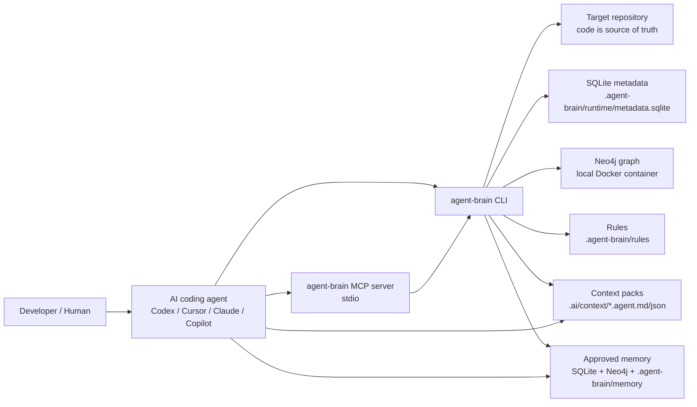
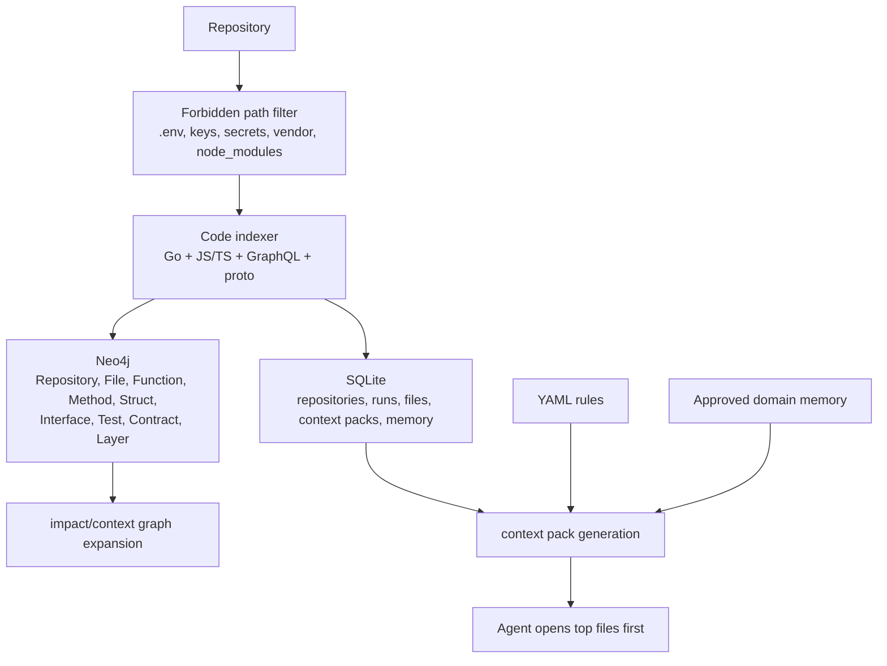
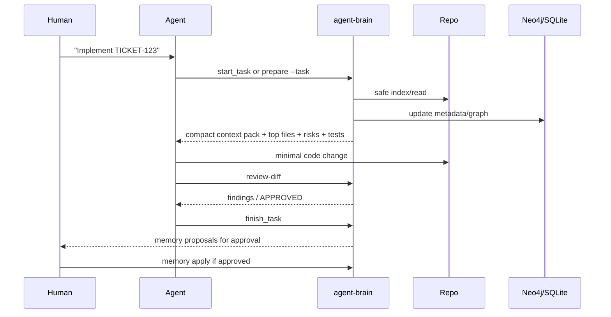
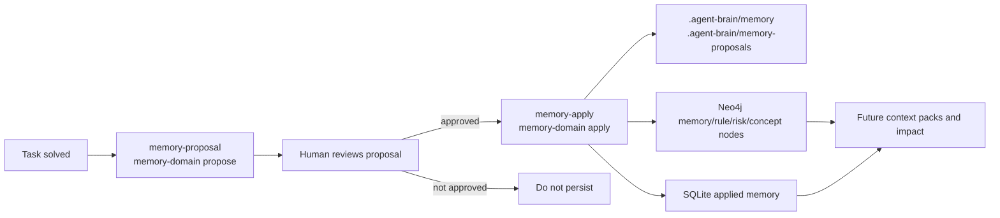

# agent-brain

`agent-brain` is a local CLI for AI coding agents. It indexes a repository, stores local metadata in SQLite, builds a technical graph in Neo4j, and generates compact context packs so tools like Codex and Cursor can work with fewer tokens and better engineering judgment.

The mental model is simple: the graph guides the agent, but code remains the source of truth.

## Why Go

Go is used because it gives `agent-brain` a portable single binary, straightforward CLI distribution, excellent Docker/process support, and first-class parsing of Go code through the standard library. The internal design follows a clean/hexagonal architecture so future adapters, including an MCP server, can be added without rewriting the core.

## Requirements

- Docker running locally.
- Go 1.22+ for development.
- No cloud services are required.

## Install

```sh
go install github.com/NanoCycles/agent-brain/cmd/agent-brain@latest
```

From source:

```sh
make build
```

From GitHub Releases:

```sh
curl -fsSL https://raw.githubusercontent.com/NanoCycles/agent-brain/main/scripts/install.sh | sh
```

Windows PowerShell:

```powershell
iwr https://raw.githubusercontent.com/NanoCycles/agent-brain/main/scripts/install.ps1 -UseB | iex
```

Windows with Chocolatey:

```powershell
iwr https://raw.githubusercontent.com/NanoCycles/agent-brain/main/scripts/install-choco.ps1 -UseB | iex
```

After the Chocolatey community package is approved, installation becomes:

```powershell
choco install agent-brain -y
```

With npm:

```sh
npm install -g @nanocycles/agent-brain
```

## Quickstart

```sh
agent-brain prepare --task .ai/tasks/TICKET.md
```

First run in a repository:

```sh
agent-brain init
agent-brain up
agent-brain index --repo .
agent-brain status
```

Then create or import a task and prepare the agent context:

```sh
mkdir -p .ai/tasks
echo "# TICKET-123\n\nDescribe the bug or feature here." > .ai/tasks/TICKET-123.md
agent-brain prepare --task .ai/tasks/TICKET-123.md --budget cavernicola
```

For Jira-driven work:

```sh
agent-brain jira import https://your-site.atlassian.net/browse/AK-123
agent-brain prepare --task .ai/tasks/AK-123.md
```

Set `JIRA_BASE_URL`, `JIRA_EMAIL`, and `JIRA_API_TOKEN` to import Jira content through the REST API. Without credentials, `jira import` can create a safe local task shell with `--offline`.

Neo4j runs locally with user `neo4j` and password `agentbrain`. Each initialized repository gets its own `project_id`, Docker Compose project, Neo4j container, persistent volume, and SQLite database under `.agent-brain/runtime/`, so local projects do not share graph or metadata state. Check the exact HTTP/Bolt ports with `agent-brain status`.

The default context budget is `cavernicola`: minimal tokens, top-ranked files only, compact risks/tests/strategy, and no long prose. Use `--budget standard` or `--budget deep` only when the agent truly needs more context.

## How It Works

`agent-brain` runs fully local. Each repository gets its own `.agent-brain/` directory, SQLite metadata database, Docker Compose file, Neo4j container, Neo4j volume, context packs, and memory proposals.



Indexing reads source files safely, skips forbidden paths, extracts code structure and contracts, and writes both metadata and graph nodes.



Daily agent workflow:



## Flow With Codex/Cursor

Agents should also read `AGENTS.md` in this repository. It is the compact operating contract for coding agents using `agent-brain`.

1. Create a task in `.ai/tasks/TICKET.md`.
2. Run `agent-brain agent-start --task .ai/tasks/TICKET.md`.
3. Ask the agent to read `.ai/context/<TASK_ID>.agent.md` before editing, or paste the prompt printed by `agent-brain agent-start`.
4. After implementation, run `agent-brain review-diff`.
5. Generate memory with `agent-brain memory-proposal --task .ai/tasks/TICKET.md`.

`agent-start` initializes the repo if needed, starts Neo4j, indexes when needed, generates the compact context pack, and creates a domain-memory proposal when memory is empty or `--bootstrap-memory` is enabled. It does not apply memory automatically.

For MCP-connected agents, prefer this prompt:

```text
Use agent-brain first. Call agent_start_async with task_path or topic before reading files.
Open only top-ranked files first. Run focused tests. Call review_diff before final response.
Call finish_task after validation and ask before applying memory.
Do not commit or push unless explicitly asked.
```

## MCP Integration

`agent-brain` can run as a local stdio MCP server so coding agents can request compact project context directly instead of spending tokens exploring the whole repository.

For Codex Desktop/CLI on this machine:

```sh
agent-brain mcp install-codex
```

This updates `~/.codex/config.toml`, creates a timestamped backup when the file already exists, and points Codex at `agent-brain mcp serve`.

Other supported local agent configs:

```sh
agent-brain mcp install-claude
agent-brain mcp install-cursor
agent-brain mcp install-copilot
```

`install-copilot` writes workspace config to `.vscode/mcp.json` so it is explicit per project. All installers create backups before replacing existing files.

Installer targets:

| Command | Target |
|---|---|
| `agent-brain mcp install-codex` | `~/.codex/config.toml` |
| `agent-brain mcp install-claude` | Claude Desktop config |
| `agent-brain mcp install-cursor` | `~/.cursor/mcp.json` |
| `agent-brain mcp install-copilot` | `.vscode/mcp.json` in the current repo |

After installing MCP config, restart the agent application so it launches the new MCP server process.

```json
{
  "mcpServers": {
    "agent-brain": {
      "command": "agent-brain",
      "args": ["mcp", "serve"],
      "cwd": "/absolute/path/to/your/project"
    }
  }
}
```

On Windows, use the installed executable path if `agent-brain` is not on `PATH`:

```json
{
  "mcpServers": {
    "agent-brain": {
      "command": "C:\\tools\\agent-brain.exe",
      "args": ["mcp", "serve"],
      "cwd": "C:\\work\\your-project"
    }
  }
}
```

Recommended agent flow:

1. Prefer `agent_start_async` for normal coding tasks, then poll `operation_status`.
2. Use `start_task_async` or `prepare_context_async` only when you need a narrower operation.
3. Read the returned handoff, generated context pack, and approved system memory.
4. Use `impact` for focused follow-up questions.
5. Use `review_diff_async` before finalizing changes when the IDE has short tool deadlines.
6. Call `finish_task_async` after validation. It reviews the diff and proposes implementation/domain memory for human approval.

The MCP server exposes these tools: `agent_start`, `agent_start_async`, `start_task`, `start_task_async`, `finish_task`, `finish_task_async`, `prepare_context`, `prepare_context_async`, `operation_status`, `operation_cancel`, `operation_list`, `get_context_pack`, `impact`, `review_diff`, `review_diff_async`, `status`, `doctor`, `mcp_health`, `clean_context`, `memory_proposal`, `propose_domain_memory`, `bootstrap_domain_memory`, `apply_domain_memory`, `get_system_memory`, and `handoff`.

Project information updates when `prepare_context` runs, unless `no_index` is true. With `fast` enabled, indexing is skipped when the existing index is recent. Rules and applied memory remain local under `.agent-brain/` and `.ai/`, so context improves over time without using cloud services.

If an MCP host launches the server outside the project folder, pass `repo_root` in tool calls or rerun the installer from inside the target repository. Installers bind `AGENT_BRAIN_REPO_ROOT` to the current project so each local repo keeps its own SQLite database and Neo4j container/ports.

Use `mcp_health` when an IDE agent appears to use the wrong project, reports Docker as unavailable, or times out. It prints the MCP process cwd, resolved repo root, env binding, runtime state, graph state, context pack count, and next recovery action.

To safely recreate generated context packs without touching source code, memory, SQLite, or Neo4j:

```sh
agent-brain clean-context --confirm
```

## Language Support

Current indexer support:

| Language / artifact | Indexed |
|---|---|
| Go | packages, files, structs, interfaces, functions, methods, tests, imports, contracts, calls, typed interface/call hints |
| JavaScript / TypeScript | imports, require, exported functions, classes, TypeScript interfaces, class methods, tests, REST routes, GraphQL resolver-like files, event files |

## Context Efficiency

Every generated context pack includes `context_efficiency`, a compact signal for agents:

- `indexed_files`: files known in SQLite for this repo.
- `returned_files`: files included in the compact context pack.
- `files_avoided`: indexed files the agent should not open initially.
- `estimated_tokens_saved`: rough local estimate using avoided files.
- `recommended_agent_action`: whether to open top files, re-index, or ask before broad exploration.
| GraphQL schema | schema files and GraphQL contract nodes |
| protobuf | service/RPC contract nodes |

Go indexing uses `go/parser`, `go/ast`, `go/token`, and `go/packages`. JS/TS indexing intentionally uses lightweight built-in heuristics for portability and zero extra parser dependency. It is good enough for context routing, but it is not a full TypeScript compiler.

Node/TS quick test:

```sh
agent-brain init
agent-brain up
agent-brain index --repo .
agent-brain status
agent-brain impact --topic "rest auth route validation" --budget cavernicola
```

Expected result for a Node/TS repo with `package.json`: `MainLanguage=javascript/typescript`, plus REST/GraphQL/Events/Persistence/Tests capabilities when evidence exists.

## Testing In A Real Project

Use this sequence inside a target project:

```sh
agent-brain doctor
agent-brain init
agent-brain up
agent-brain index --repo .
agent-brain status
```

Create a task:

```sh
agent-brain jira import AK-123
# or, if Jira CLI credentials are not available:
agent-brain jira import AK-123 --offline
```

Generate context and inspect impact:

```sh
agent-brain agent-start --task .ai/tasks/AK-123.md --budget cavernicola
agent-brain impact --topic "main technical topic" --budget cavernicola
agent-brain memory-domain list --area all --topic "main technical topic"
```

Before finishing a code change:

```sh
agent-brain review-diff
agent-brain memory-proposal --task .ai/tasks/AK-123.md
agent-brain memory-domain propose --task .ai/tasks/AK-123.md --area all
```

For new projects, bootstrap the system/business map after the first index:

```sh
agent-brain memory-domain bootstrap --area all
```

Only apply memory after human approval:

```sh
agent-brain memory-apply .ai/memory-proposals/AK-123.yml --yes
agent-brain memory-domain apply .ai/memory-proposals/AK-123.domain.yml --yes
```

## Neo4j Browser

Use `agent-brain status` to get the per-project ports:

```text
Neo4j HTTP URL: http://localhost:<http-port>
Neo4j Bolt URI: bolt://localhost:<bolt-port>
```

Open the HTTP URL in a browser, then connect with:

```text
Protocol: bolt://
Connection URL: localhost:<bolt-port>
User: neo4j
Password: agentbrain
```

Do not use `neo4j+s://localhost:7474` for local agent-brain containers. `7474` is the default Neo4j HTTP port, while agent-brain assigns per-project ports to avoid mixing repositories.

## Commands

- `agent-brain init`: creates `.agent-brain/` and `.ai/` working directories.
- `agent-brain up`: verifies Docker and starts Neo4j through Docker Compose.
- `agent-brain down`: stops local services without deleting data.
- `agent-brain destroy --confirm`: removes this project's local Neo4j volume and SQLite metadata without touching source code, config, rules, context, or memory proposals.
- `agent-brain clean-context --confirm`: removes generated context packs without touching source code, memory, SQLite, or Neo4j.
- `agent-brain status`: prints Docker, Neo4j, SQLite, initialization, index, and graph stats.
- `agent-brain doctor`: diagnoses Docker, Neo4j, SQLite, graph, and project wiring.
- `agent-brain logs --tail 120`: prints Neo4j runtime logs for the current project.
- `agent-brain prepare --task .ai/tasks/TICKET.md`: initializes, starts services, indexes, generates context, and prints an agent handoff prompt.
- `agent-brain prepare --topic "text"`: creates a lightweight task from topic text and prepares context.
- `agent-brain prepare --budget cavernicola|compact|standard|deep`: controls how much context is returned; default is `cavernicola`.
- `agent-brain prepare --fast`: skips reindexing when the last index is recent.
- `agent-brain prepare --no-index`: generates context from current metadata without indexing.
- `agent-brain agent-start --task .ai/tasks/TICKET.md`: runs the full agent startup workflow and proposes domain memory when needed.
- `agent-brain handoff --task .ai/tasks/TICKET.md`: prints a prompt for Codex/Cursor/Claude to use the generated context pack.
- `agent-brain mcp serve`: starts the stdio MCP server for AI coding agents.
- `agent-brain mcp install-codex`: installs the local MCP server into Codex config with a backup.
- `agent-brain mcp install-claude`: installs the local MCP server into Claude Desktop config with a backup.
- `agent-brain mcp install-cursor`: installs the local MCP server into Cursor config with a backup.
- `agent-brain mcp install-copilot`: installs workspace MCP config into `.vscode/mcp.json` for GitHub Copilot.
- `agent-brain jira import AK-123`: imports a Jira issue into `.ai/tasks/AK-123.md`.
- `agent-brain index --repo .`: indexes a Go repository into SQLite and Neo4j.
- `agent-brain index --repo . --incremental`: skips graph rewrite when indexed file hashes did not change.
- `agent-brain context --task .ai/tasks/TICKET.md`: writes Markdown and JSON context packs.
- `agent-brain impact --topic "text"`: searches graph impact.
- `agent-brain review-plan --plan path/to/plan.md`: reviews an agent plan.
- `agent-brain review-comments --file review-comments.md`: turns external review comments into a prioritized agent repair plan.
- `agent-brain review-diff`: reviews the current git diff without modifying files.
- `agent-brain memory-proposal --task .ai/tasks/TICKET.md`: writes a structured memory proposal.
- `agent-brain memory-apply <proposal.yml>`: validates and applies memory after confirmation.
- `agent-brain memory-domain propose --task .ai/tasks/TICKET.md --area graphql`: proposes system/business memory by area.
- `agent-brain memory-domain bootstrap --area all`: creates an initial domain memory proposal from indexed code.
- `agent-brain memory-domain apply .ai/memory-proposals/TICKET.domain.yml --yes`: applies approved domain memory to file, SQLite, and Neo4j.
- `agent-brain memory-domain list --area graphql --topic "nested count"`: prints compact approved system memory.

## Memory Model

Memory is local and explicit. A proposal is first written to `.ai/memory-proposals/` and is not trusted until it is confirmed. Implementation memory captures what changed for a task. Domain memory captures how the system works: concepts, components, business rules, and invariants, grouped by areas such as `graphql`, `auth`, `billing`, `events`, and `persistence`.

Applied memory is stored in SQLite as the local audit/source-of-truth record and mirrored into Neo4j as technical/business graph nodes so future impact/context queries can use it. Source code remains the source of truth for implementation details.

Memory lifecycle:



Implementation memory is useful for historical task learning. Domain memory is more important for long-lived business context: what the system does, which components own behavior, public contract semantics, security invariants, and known pitfalls.

## Review Quality

`review-diff` is intentionally read-only. It checks changed files, contracts, forbidden paths, introduced enterprise risks, and test coverage evidence. If the diff does not add tests, it searches for existing related tests near the changed code and prints them as tests to run instead of blindly failing with "No tests detected".

`review-comments` turns external review text into a prioritized repair plan:

```sh
agent-brain review-comments --file .ai/reviews/TICKET-review-comments.md
```

This is intended for GitHub comments from Claude, Copilot, human reviewers, or internal review bots. The agent should fix critical/high findings first, run focused tests, then call `review-diff` again.

## Security

`agent-brain` is safe by default:

- It does not modify target repository code during indexing.
- It does not run commit, push, merge, reset, or destructive git commands.
- It refuses to index known secret paths such as `.env`, `.env.*`, `*.pem`, `*.key`, `credentials`, `secrets`, `kubeconfig`, `id_rsa`, and `id_ed25519`.
- It avoids printing sensitive values.
- The default Neo4j password is for local development only. Do not expose the generated Neo4j ports to untrusted networks.

## Dependencies

- Cobra: stable CLI command framework.
- modernc.org/sqlite: SQLite driver for `database/sql` without CGO.
- neo4j-go-driver: official Neo4j Go driver.
- golang.org/x/tools/go/packages: typed Go package loading for more accurate Go call graph and interface implementation analysis.
- yaml.v3: small YAML parser for local rules and config.

The Node/JavaScript/TypeScript indexer intentionally uses lightweight built-in parsing heuristics for MVP portability: imports, exported functions, classes, TypeScript interfaces, tests, REST route registrations, GraphQL resolver-like files, and event files are indexed without adding a JS parser dependency.

## Publishing Releases

Public binaries are produced with GoReleaser through GitHub Actions.

```sh
git tag v0.1.0
git push origin v0.1.0
```

The release workflow runs tests and publishes Linux, macOS, Windows archives, checksums, installer scripts, a Chocolatey `.nupkg`, and an npm package tarball. If `CHOCOLATEY_API_KEY` or `NPM_TOKEN` repository secrets are configured, the workflow also pushes to Chocolatey Community and npm.

## Roadmap

- Qdrant/vector DB for semantic retrieval.
- Deeper MCP resources/prompts and streaming progress.
- Web dashboard.
- Desktop app.
- Multi-repo workspace support.
- CI integration.
